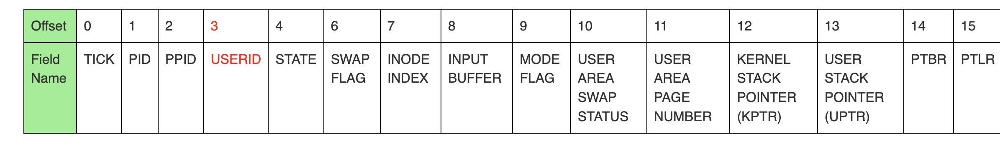

# Process Control Block

mode flag :Used to store system call number if the process is executing inside a sys call. -1 if exception handler, 0 otherwise

# 1.Inorder to invoke a system call

- push registers in use to stack
- push system call number
- push three arguments
- push R0 for the return value
- INT n , invoke the call

# 2.System call routine on entry

- extract sys call no and args
- set MODE to sys call no
- user to kernel stack
- transfer control to sys call code

# 3.System call service on return

- return val to user stack
- SP to top of user stack
- MODE to 0
- iret

# 4.process after return

store return val,revert back to the stack and resume exec
 