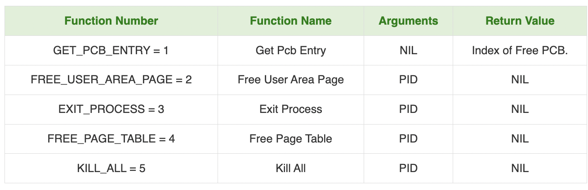

# Inode Table

- MAX_FILE_NUM = 60 entries
- 16 words out of which 7 unused

## entry format

- FILE TYPE :DATA, EXEC, ROOT
- FILE NAME
- FILE SIZE (MAX_FILE_SIZE = 2048 WORDS, 4 BLOCKS)
- DATA BLOCK (1 - 4 WORDS)

- memory copy of inode present in page 59, pointed by INODE_TABLE

# System Status Table

- CURRENT_USER_ID
- CURRENT_PID
- MEM_FREE_COUNT
- WAIT_MEM_COUNT
- SWAPPED_COUNT
- PAGING_STATUS

# MODULE 2 (memory manager)

# MODULE 1(process manager)

