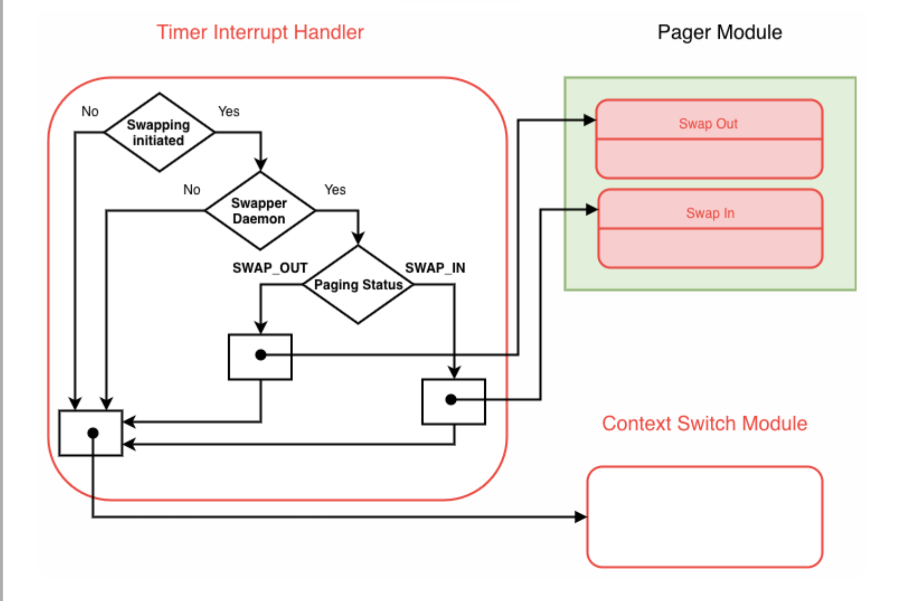
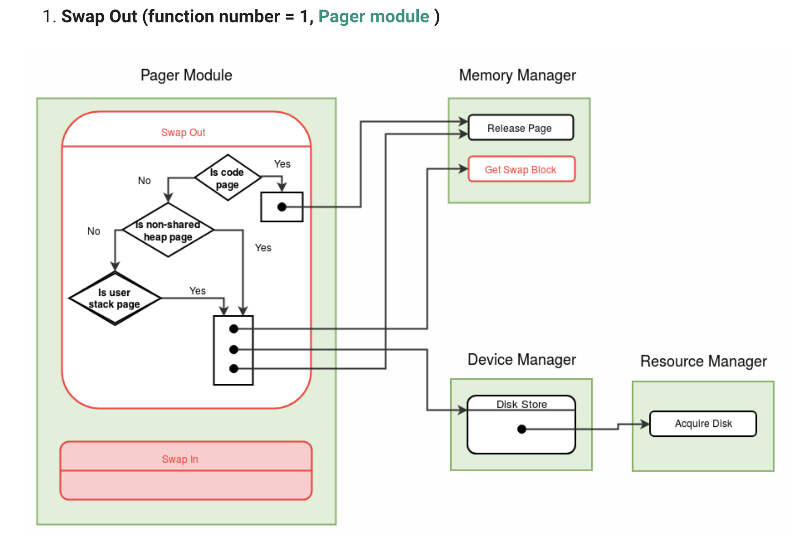

- number of memory pages available for user processes 52 (76 - 127)
- critical level MEM_LOW = 4
- code pages are not copied to disk as it already contains a copy of those
- 256 reserved blocks in disk (256 - 511)
- swapper daemon pid = 15

## Timer Interrupt

- 

## Swap out

- 
